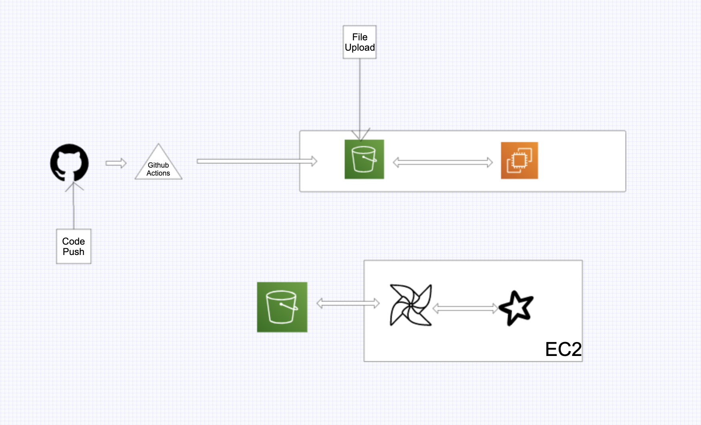

# SearchProductInsights

## Table of contents
* [General info](#general-info)
* [Technologies](#technologies)
* [High Level Architecture](#high-level-architecture)
* [Current Setup](#current-setup)
* [Architecture Considerations](#architecture-considerations)
* [Future Improvements](#future-improvements)
* [Business Problem](#business-problem)


## General info
This project is a data processing project.

## Technologies
Project is created with:
* Github Actions
* Python
* Apache Airflow
* Apache Spark
* Amazon EC2
* Amazon S3
* Bash/Shell

## High Level Architecture


## Current Setup
* Currently, with every push to github and change compute scripts in the ec2 folder, github actions triggers a build which runs a few test cases and then syncs the scripts to an s3 bucket location.
* Data is uploaded to a bucket in s3 as well.
* Apache airflow has a DAG to schedule the job to run on a schedule. The dag gets the data file and compute scripts from S3 bucket into the EC2
* DAG then triggers a task to run a Spark Job using spark submit
* On completion, next DAG task cleans up and moves the results to s3 back.

## Architecture considerations
Current architecture is based on a frugal approach but some other better solutions would be-

* Managed Airflow
* EMR or EKS backed EMR instead of Spark on EC2 (chose this to not have to spend money)
* Proper IAM roles and VPC's
* Handling of secrets in vault

## Future Improvements
* Add docker instructions for quick local setup and development
* automate deployments using terraform for infrastructure

## Business Problem

The basic idea is to provide the client how much revenue it is generating with the help of external search engines and what keywords are helping them most.

### Doubts and considerations
* The final output, is it just 1 keyword (most popular) per external search engine that needs to be shown or all of them in decreasing popularity order. So there would be multiple entries for each search engine based on keywords existing.
* Also, is the revenue total revenue of the search domain or for the keyword within the domain itself.
* Third, some product lists don't have revenue but the same product in another list does have revenue. Can that other revenue be used to find out price per unit and update accordingly?
* Also, most of the product lists were empty, so I created another sample file for testing as well.
* Finally, for getting keywords I have scraped through the url's with regexes for p= and q= 
* For all the doubts above, I have considered and added code that could handle all the situations.


```
+-------+-------+--------------+
|Search Domain|Search Keyword|Revenue|
+-------+-------+--------------+
|yahoo  |Zavia  |1720.0        |
|google |Zune   |1090.0        |
|google |Zavia  |1090.0        |
|bing   |Zavia  |310.0         |
+-------+-------+--------------+
```
This above would be multiple keywords per search domain and revenue showing search domain total revenue but keywords ordered in decreasing popularity.
```
+-------+-------+---------------------+
|Search Domain|Search Keyword|Revenue|
+-------+-------+---------------------+
|yahoo  |Zavia  |1720.0               |
|google |Zune   |620.0                |
|bing   |Zavia  |310.0                |
+-------+-------+---------------------+
```
This above would be single keywords per search domain and revenue showing keyword revenue within domain and keywords ordered in decreasing popularity.
```
+-------+-------+---------------------+
|Search Domain|Search Keyword|Revenue|
+-------+-------+---------------------+
|yahoo  |Zavia  |1720.0               |
|google |Zune   |620.0                |
|google |Zavia  |470.0                |
|bing   |Zavia  |310.0                |
+-------+-------+---------------------+
```
This above would be multiple keywords per search domain and revenue showing keyword revenue within domain and keywords ordered in decreasing popularity.

```
+-------+-------+--------------+
|Search Domain|Search Keyword|Revenue|
+-------+-------+--------------+
|yahoo  |Zavia  |1720.0        |
|google |Zune   |1090.0        |
|bing   |Zavia  |310.0         |
+-------+-------+--------------+
```
This above would be single keywords per search domain and revenue showing search domain total revenue and keywords ordered in decreasing popularity.
